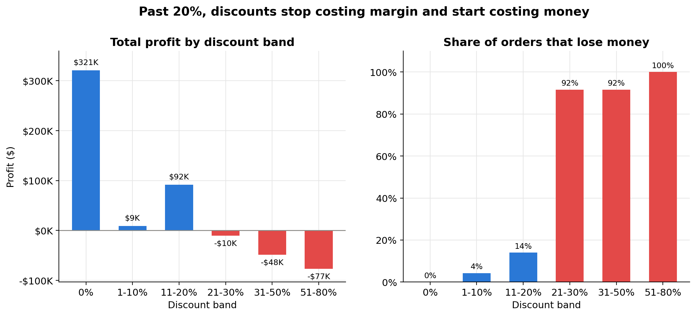
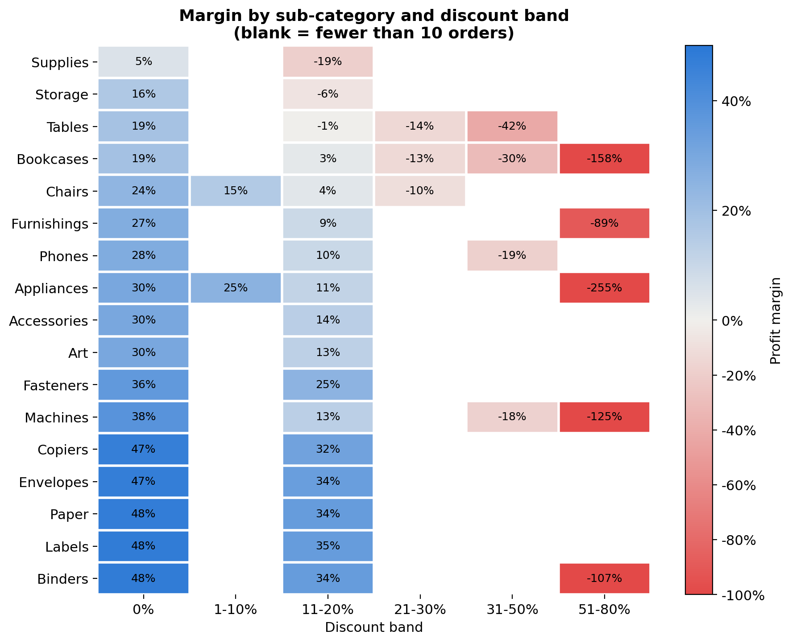
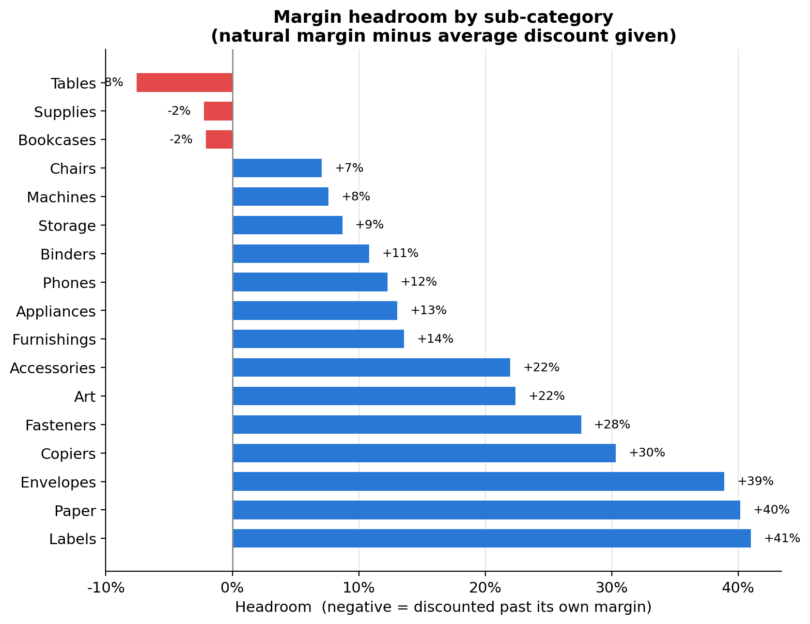
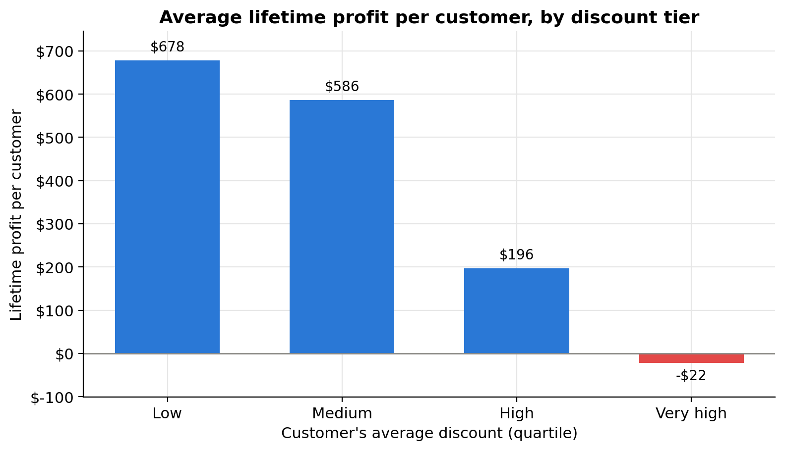
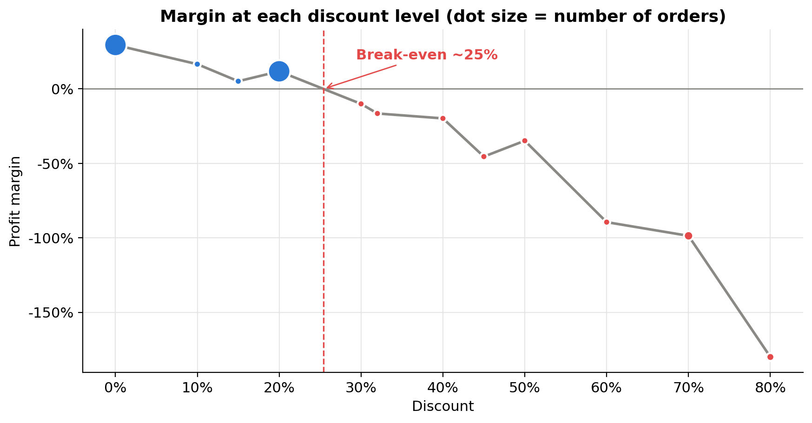
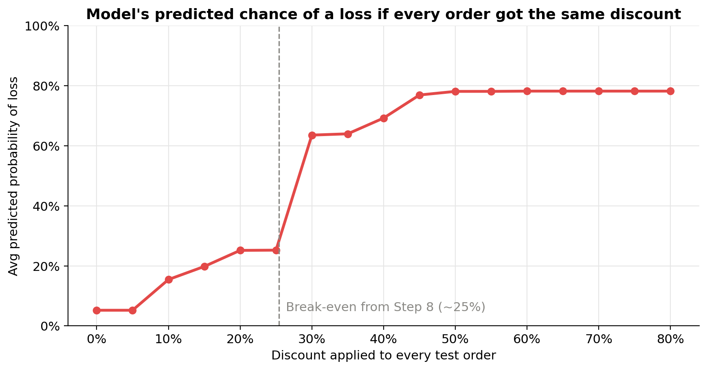
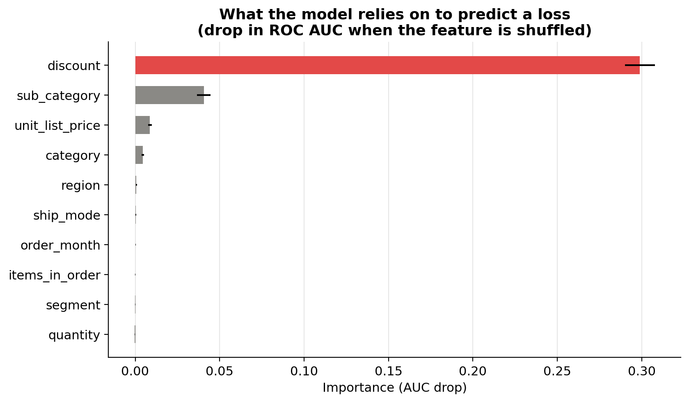
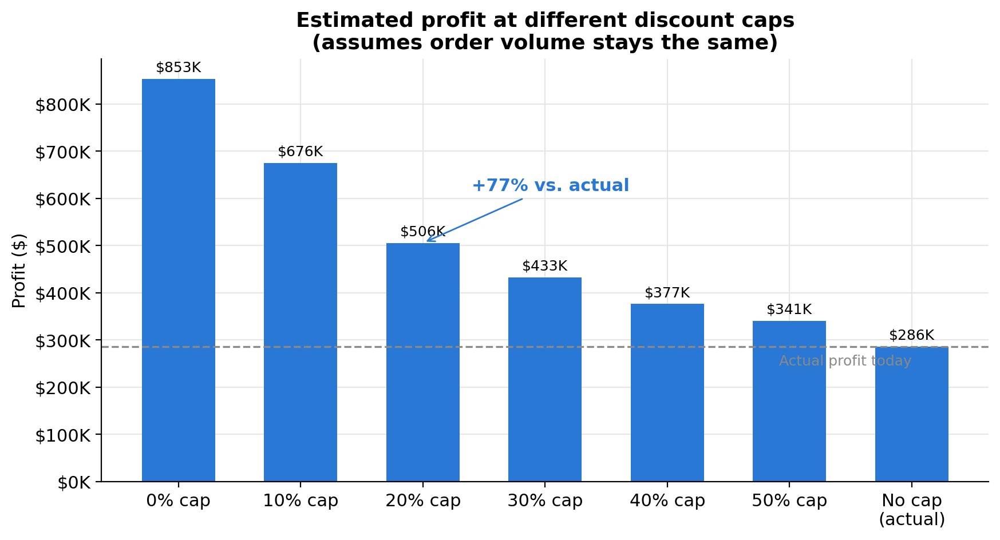

# 01 · Discount Impact Analysis

**Business question:** Do discounts actually make the business money, or do they just inflate revenue while eating profit?

**Short answer:** They eat profit. Every loss-making order line in the data carries a discount, margins turn negative at about a **25% discount**, and discounted orders are no bigger than full-price ones. The business gave away **$566,734** in discounts to earn **$286,397** in profit.



---

## Data

- **Dataset:** Sample Superstore, from Kaggle: [Superstore Dataset](https://www.kaggle.com/datasets/vivek468/superstore-dataset-final). There are 9,994 order lines from 2014–2017, with sales, quantity, discount, profit, product (category / sub-category), region, segment, ship mode and order/ship dates.
- **Where it goes:** `01-discount-impact/data/Sample - Superstore.csv`. The `data/` folder is git-ignored, so download the CSV from Kaggle and place it there before running the notebook.

### Cleaning notes

- The file is read with `encoding="latin-1"` because some product names contain non-UTF-8 characters.
- Column names are standardised to `snake_case` (e.g. `Sub-Category` becomes `sub_category`).
- There are **no missing values** and **no duplicate rows** (0 dropped).
- `order_date` and `ship_date` are parsed to datetimes.
- The discount takes only 12 distinct values (0%, 10%, 15%, 20%, 30%, 32%, 40%, 45%, 50%, 60%, 70%, 80%). These are grouped into six **discount bands** (0%, 1–10%, 11–20%, 21–30%, 31–50%, 51–80%) for the summaries and charts. The exact levels are used to locate the break-even point.

---

## Method

The notebook ([`notebook.ipynb`](notebook.ipynb)) has five blocks.

1. **Setup and first look.** Load and clean the data, then take a first look: 18.7% of lines lose money and 52.0% carry a discount.
2. **Core evidence**
   - Profit, margin and loss rate by discount band.
   - A sub-category × discount-band margin heatmap, to rule out product mix as the explanation.
   - A break-even discount, found by linear interpolation between the last profitable and first loss-making discount levels.
   - A like-for-like volume test: the same product with and without a discount, compared with a Wilcoxon signed-rank test.
3. **Feature engineering**
   - Rebuild each line's unit economics: list-price revenue, discount dollars, cost, unit list price, unit cost, profit before discount and natural margin. A check confirms that 98.2% of products have one consistent unit price and unit cost, so the reconstruction is valid.
   - A **margin-headroom** feature: the sub-category's undiscounted margin minus the discount. A flag marks lines where the discount exceeds the margin.
   - Time and order features (year, quarter, days to ship, items per order), customer-level discount tiers, and region/segment checks.
   - A **discount-cap simulation**: line profit is recomputed with capped discounts, assuming volume doesn't change.
4. **Machine learning**
   - Predict whether an order line loses money, using only information known at the time of sale. Leaky, profit-derived features are excluded.
   - Logistic regression and random forest models in scikit-learn pipelines, with a stratified 75/25 train/test split.
   - An **ablation test**: all features vs. no discount vs. discount only.
   - Permutation importance.
   - A hand-built what-if curve: every test order gets the same discount, and the model predicts the loss risk.
5. **Summary.** The key numbers and takeaways.

---

## Results

### Profit by discount band

| Discount band | Order lines | Sales | Profit | Margin | Lines losing money |
|---|---:|---:|---:|---:|---:|
| 0% | 4,798 | $1,087,908 | $320,988 | 29.5% | 0.0% |
| 1–10% | 94 | $54,369 | $9,029 | 16.6% | 4.3% |
| 11–20% | 3,709 | $792,153 | $91,756 | 11.6% | 14.0% |
| 21–30% | 227 | $103,227 | −$10,369 | −10.0% | 91.6% |
| 31–50% | 310 | $195,315 | −$48,448 | −24.8% | 91.6% |
| 51–80% | 856 | $64,229 | −$76,559 | −119.2% | 100.0% |

### Key numbers

| Finding | Result |
|---|---:|
| Loss-making lines with **no** discount | **0** |
| Estimated break-even discount | ~25% |
| Share of all losses coming from discounts above 20% | 88.7% |
| Discount dollars given away / actual profit | $566,734 / $286,397 (2.0×) |
| Extra units per order when the same product is discounted | +0.01 (Wilcoxon p = 0.908) |
| Loss rate when the discount exceeds the sub-category's natural margin | 84.6% (vs. 3.4% within margin) |
| Avg lifetime profit per customer: lowest vs. highest discount quartile | $678 vs. −$22 |
| Correlation of "line loses money" with discount / days to ship / items per order | 0.75 / 0.00 / 0.00 |
| Region with highest avg discount → margin | Central, 24.0% → 7.9% |
| Region with lowest avg discount → margin | West, 10.9% → 14.9% |
| Estimated profit with a 20% discount cap | $505,588 (+$219,191, +77%) |
| Order lines affected by a 20% cap | 1,393 of 9,994 (13.9%) |

### Machine learning (test set: 2,499 lines)

| Model / feature set | ROC AUC |
|---|---:|
| Logistic regression, all features | 0.986 |
| Random forest, all features | 0.988 |
| Random forest, all features **except** discount | 0.884 |
| Random forest, **discount only** | 0.945 |

- The random forest catches **91%** of loss-making lines (428 of 468), with 80% precision.
- **Permutation importance:** shuffling discount drops AUC by 0.299. Sub-category is next at 0.041, and every other feature is below 0.01.
- **What-if:** with every test order set to the same discount, the average predicted loss risk is 5.2% at 0%, 25.2% at 25% and **63.6% at 30%**. The biggest jump sits right at the ~25% break-even found independently from the raw data.

### Charts

| | |
|---|---|
|  |  |
|  |  |
|  |  |



---

## Recommendation

1. **Cap standard discounts at 20%.** Anything deeper should need approval. The 11–20% band is still profitable (11.6% margin), and every band above it loses money in total. The cap touches only 13.9% of order lines and, if volume holds, is worth an estimated **+$219K (+77%)** in profit.
2. **Set caps per sub-category, not one company-wide number.** Never discount past a product's natural margin; when that happens, 84.6% of lines lose money. The thin-margin lines need the tightest limits: Supplies (5.4% natural margin), Storage (16.2%), Tables (18.5%) and Bookcases (19.0%). Tables are currently discounted 26.1% on average.
3. **Review the Central region's discounting first.** It has the highest average discount (24.0%), the highest loss rate (31.9%) and the lowest margin (7.9%).
4. **Stop using deep discounts to "retain" customers.** The most discount-dependent quartile places no more orders than the rest, spends less, and is unprofitable on average.
5. **Flag risky orders before they ship.** Discount alone predicts loss-making lines with 0.945 AUC, so a simple rule or model in the order system could flag them for review.

### Limitations

- This is observational data. The causal reading rests on the unit-economics check: the discount is a pure price cut on a fixed unit cost.
- We only see orders that happened, not customers who might not have bought without a discount.
- The cap simulation assumes volume stays the same. The volume test supports this but can't guarantee it.
- Sample Superstore is a teaching dataset. The method transfers to real data; the exact numbers won't.

---

## How to run

```bash
pip install pandas numpy matplotlib scipy scikit-learn
```

1. Place `Sample - Superstore.csv` in `01-discount-impact/data/`.
2. Run [`notebook.ipynb`](notebook.ipynb) top to bottom. Charts are saved to [`charts/`](charts/).

---

**Author:** Ofor Chukwuebuka Emmanuel · [LinkedIn](https://www.linkedin.com/in/ebuka-enterprises)
